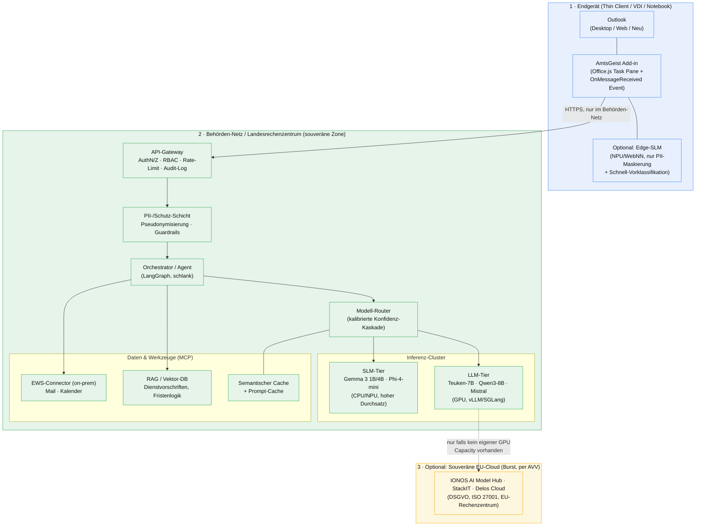
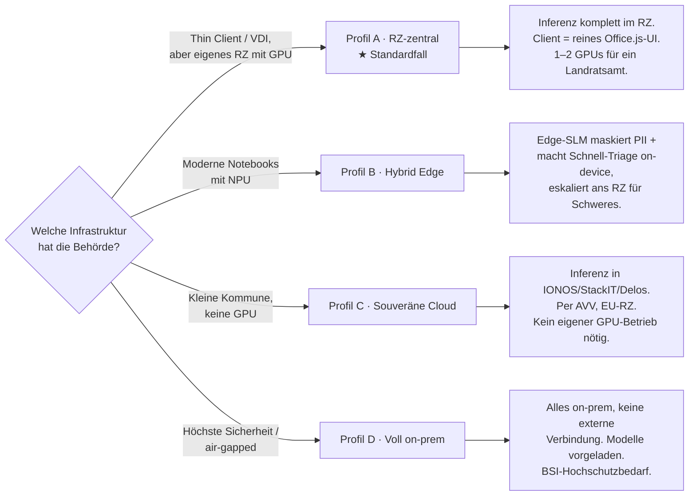
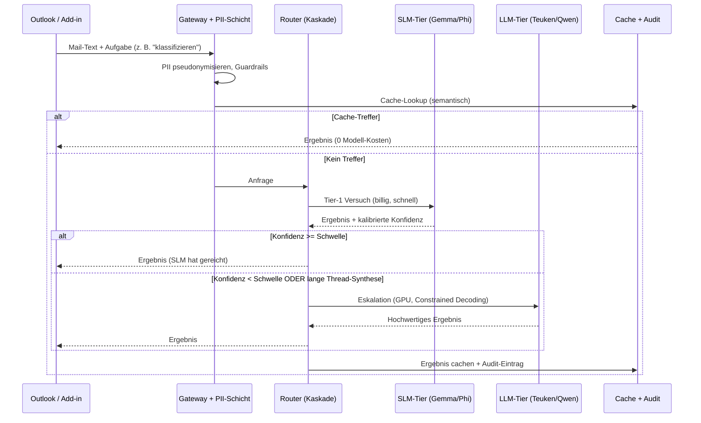
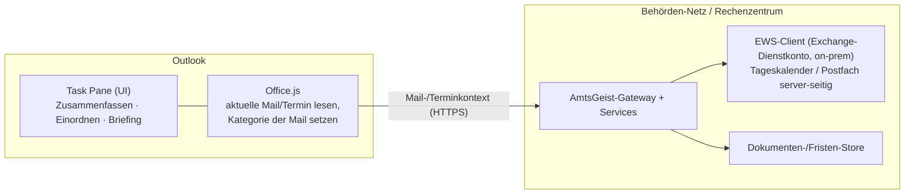
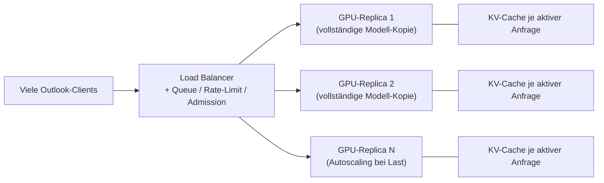
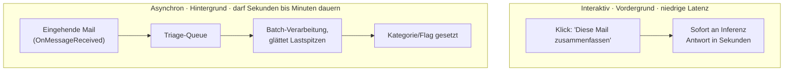

# AmtsGeist — Architektur-Konzept: Souveräner KI-Assistent für Outlook

> **Scope:** Ein DSGVO-konformer Assistent in Microsoft Outlook, der für Beamtinnen und Beamte
> E-Mails **zusammenfasst**, eingehende Post **klassifiziert/sortiert/markiert** und aus Kalender +
> markierter Post ein **Tagesbriefing** erzeugt — vollständig **souverän** (on-device, on-premise
> oder souveräne EU-Cloud), ohne dass Inhalte je einen US-/Drittland-Dienst erreichen.
>
> Stand: Mai 2026. Dieses Dokument ist ein **Konzept**, kein fertiger Code.

---

## 0. Die These in einem Satz

> Auf einem typischen Verwaltungs-Arbeitsplatz läuft **kein** großes Sprachmodell — also darf die
> Architektur das auch nicht voraussetzen. AmtsGeist verlagert die Intelligenz **vom Endgerät weg**
> in das Behörden-Rechenzentrum, hält am Endgerät nur eine **dünne, datensparsame** Schicht und
> nutzt eine **Modell-Kaskade**, damit 80 % der Anfragen von einem winzigen, billigen Modell
> erledigt werden und nur der Rest ein großes Modell kostet.

---

## 1. Die harte Randbedingung: Realität der Behörden-Arbeitsplätze

Jede Architektur, die „das Modell läuft lokal auf dem Laptop der Sachbearbeiterin" annimmt,
scheitert in der deutschen Verwaltung an der Realität. Typische Endgeräte:

| Typ | Verbreitung | Rechenleistung für KI | Konsequenz |
|---|---|---|---|
| **Thin Client / Zero Client** (Dataport, AKDB, …) | sehr hoch | praktisch keine (2–4 GB RAM, kein GPU) | Inferenz **muss** server-seitig laufen |
| **VDI-Sitzung** (virtueller Desktop) | hoch | shared CPU, kein GPU-Passthrough | „Endgerät" ist faktisch ein Server-Share |
| **Standard-Notebook**, gesperrtes Windows, keine Admin-Rechte | hoch | i5/i7, 8–16 GB RAM, iGPU | kann Office.js, aber **kein** Ollama installieren |
| **Copilot+ PC / Intel Core Ultra (NPU)** | wachsend, noch selten | NPU ~10 tok/s, energiesparend, **nicht** schneller als CPU bei LLMs | nur für leichte Hintergrund-Aufgaben |

**Schlussfolgerungen, die das gesamte Design prägen:**

1. **Endgerät-Inferenz ist die Ausnahme, nicht die Regel.** „Lokal" heißt für die Verwaltung
   primär **„im eigenen Rechenzentrum / Landesrechenzentrum"**, nicht „auf dem Client".
2. **Keine Installation auf dem Client.** Auslieferung muss über ein **Office-Add-in (Office.js)**
   erfolgen — zentral verteilbar, ohne Admin-Rechte, ohne MSI.
3. **Der Mail-Store ist der eigentliche Souveränitäts-Knackpunkt.** Bei *Exchange Online* (US-Cloud)
   liegen die Mails bereits dort. Souverän wird das nur mit **On-Prem-Exchange** oder der
   **Delos Cloud** (souveräne MS-Cloud für Behörden). Das Add-in löst Inferenz-Souveränität;
   die Mail-Store-Souveränität ist eine **organisatorische** Voraussetzung.

---

## 2. Architekturprinzipien

| Prinzip | Bedeutung |
|---|---|
| **Edge-Minimierung** | Am Client nur UI + Datensparsamkeit (PII-Reduktion), keine schwere Inferenz. |
| **Datensparsamkeit am Eingang** | Bevor Text das Endgerät/den Tenant verlässt: optionale PII-Pseudonymisierung. |
| **Kaskade statt Monolith** | Kleines Modell zuerst, Eskalation nur bei niedriger kalibrierter Konfidenz (Kostensenkung 45–85 % bei ~95 % Qualität laut Routing-Forschung). |
| **Strukturierte Ausgabe erzwingen** | Klassifikation/Markierung via **Constrained Decoding** (JSON-Schema/Grammatik) — kein Freitext, kein „Halluzinieren" von Kategorien. |
| **Souverän by Origin** | Modell-Erstwahl ist ein europäisches Modell (**Teuken-7B**, EuroLLM, Mistral); US-Open-Weights nur als Option. |
| **Bewertbar (EU AI Act)** | Jede Funktion hat ein **Eval-Set** + Qualitäts-Gate. Hochrisiko-KI im öffentlichen Sektor erfordert dokumentierte Evaluation. |
| **Auditierbar** | Jede KI-Aktion erzeugt einen unveränderlichen Audit-Log-Eintrag (wer, was, welches Modell, welche Konfidenz). |
| **Mensch entscheidet** | Der Assistent **schlägt vor** (Markierung, Entwurf, Briefing). Verschieben/Senden/Löschen bleibt beim Menschen. |

---

## 3. Gesamtarchitektur (Schichtenmodell)

**Lesehilfe:** Schicht 1 ist „dumm" (UI + optional Datensparsamkeit). Die Intelligenz lebt in
Schicht 2 — **innerhalb des Behörden-Netzes**. Schicht 3 ist ein optionaler Ausweg für Behörden
ohne eigene GPU-Kapazität und bleibt durch Auftragsverarbeitungsvertrag (AVV) in der EU.

---

## 4. Vier Deployment-Profile (an Hardware angepasst)

Eine Architektur — vier Betriebsmodi, je nach vorhandener Infrastruktur:

| Profil | Inferenz läuft … | Endgerät-Anforderung | Typische Behörde |
|---|---|---|---|
| **A — RZ-zentral** *(Standard)* | im eigenen/Landes-RZ (GPU) | beliebig, auch Thin Client | Land, größere Kommune, Ministerium |
| **B — Hybrid Edge** | Edge-SLM + RZ-Eskalation | Copilot+ PC / Core Ultra | moderne Notebook-Flotte |
| **C — Souveräne Cloud** | IONOS / StackIT / Delos (EU) | beliebig | kleine Kommune ohne RZ |
| **D — Voll on-prem (air-gapped)** | abgeschottetes RZ | beliebig | Sicherheits-/Verfassungsbereich |

> **Kernpunkt für „Beamte haben wenig Leistung":** In Profil A und C ist die Client-Leistung
> **irrelevant** — ein 4 GB-Thin-Client genügt, weil er nur die Add-in-Oberfläche rendert.
> Profil B nutzt die NPU **nur** für leichte Hintergrundaufgaben (PII-Maskierung, Vor-Sortierung),
> da NPUs bei LLM-Inferenz energieeffizient, aber **nicht** schneller als die CPU sind.

---

## 5. Der Inferenz-Kern: Modell-Kaskade & Routing

Das ist das Herzstück der Effizienz. Statt jede Anfrage an ein großes Modell zu geben, durchläuft
sie eine **Kaskade**: das kleinste fähige Modell zuerst, Eskalation nur bei niedriger
**kalibrierter** Konfidenz.

**Aufgaben-Zuordnung in der Kaskade:**

| Aufgabe | Primär-Tier | Eskalation wenn … | Technik |
|---|---|---|---|
| **Klassifizieren / Markieren / Sortieren** | SLM (1–4B) | Konfidenz < Schwelle, mehrdeutig | **Constrained Decoding** auf festes JSON-Schema (Kategorie, Priorität, Frist, Zielordner) |
| **Kurz-Zusammenfassung** (eine Mail) | SLM | sehr langer Text | begrenzte Token-Ausgabe |
| **Thread-Synthese** (langer Verlauf) | LLM | immer | map-reduce über Nachrichten |
| **Antwort-Entwurf** (Bürgerschreiben) | LLM | immer | RAG-gestützt (Textbausteine, Vorschriften) |
| **Tagesbriefing** | LLM (Agent) | immer | Kalender + markierte Mails + Fristen |

**Warum kalibrierte Konfidenz?** Selbstberichtete LLM-Sicherheit ist notorisch
schlecht kalibriert — ein Modell klingt überzeugt und liegt falsch. Daher: Token-Margin-Aggregation
+ isotonische Regression (UCCI-Ansatz) liefert verlässliche Fehlerwahrscheinlichkeiten als
Eskalations-Trigger. Für die strukturierte Triage erhöht **Draft-Conditioned Constrained Decoding**
die strikte Format-Treue deutlich und lässt kleine Modelle an größere heranreichen.

---

## 6. Modellauswahl

**Erstwahl souverän (Herkunft EU):**

| Modell | Größe | Warum |
|---|---|---|
| **Teuken-7B-instruct** (OpenGPT-X / Fraunhofer) | 7B | Apache 2.0, in **allen 24 EU-Sprachen** trainiert, in Deutschland (JUWELS) gebaut — maximale Souveränitäts-Story. Über IONOS AI Model Hub gehostet verfügbar. |
| **EuroLLM-9B** | 9B | EU-finanziert, mehrsprachig, offen. |
| **Mistral Small / Ministral** | 3–24B | EU-Unternehmen, starke offene Gewichte, gute deutsche Leistung. |

**SLM-Tier (Klassifikation, Schnell-Tasks, CPU/NPU):**

| Modell | Größe | RAM (Q4) | Benchmark-Schlaglicht |
|---|---|---|---|
| **Gemma 3 1B** | 1B | ~1 GB | >2500 tok/s auf mobiler GPU, 62.8 % GSM8K — ideal für Klassifikation |
| **Gemma 3 4B** | 4B | **~4.2 GB** | 89.2 % GSM8K, ~94 s Antwort auf reiner CPU — RAM-effizientester Allrounder |
| **Phi-4-mini** | 3.8B | ~7.5 GB (GPU) | 83.7 % ARC-C — stark im Schlussfolgern |
| **Gemma 3n E4B** | ~4B effektiv | ~3 GB | für Endgeräte gebaut, erstes sub-10B über 1300 LMArena-Elo |

**LLM-Tier (Synthese, Entwürfe, Briefing, GPU):**
Teuken-7B / Qwen3-8B / Mistral Small — über **vLLM** oder **SGLang** mit Continuous Batching
und Paged Attention für **Mehrbenutzer-Durchsatz** (nicht Ollama, das für Einzelnutzer optimiert ist).

> **Quantisierung:** GGUF **Q4_K_M** oder AWQ als Standard. Für NPU-Endgeräte: OpenVINO INT4,
> Gruppengröße 128 (empfohlen bis ~4–5B). Speculative Decoding senkt die Latenz im LLM-Tier.

---

## 7. Integrationsschicht (Outlook ↔ AmtsGeist)

> **Bewusst ohne Microsoft Graph.** Graph erfordert eine Azure-/Entra-App-Registrierung **plus
> Admin-Consent** im Behörden-Tenant — als externer Anbieter realistisch kaum erreichbar. Der
> Zugriff erfolgt daher graph-frei: **Office.js** am Client und **EWS** server-seitig. Details:
> Issue #8.

**Bausteine & technische Eckdaten:**

- **Auslieferung als Office-Add-in (Office.js)** — zentral per Admin verteilbar, keine
  Client-Installation, läuft auf Desktop, Web und „neuem" Outlook.
- **Client-seitig via Office.js (ohne Sonderberechtigung):** aktuelle Mail lesen, **Kategorie der
  geöffneten Mail** setzen, **aktuell geöffneten Termin** auslesen (Lesemodus).
- **Server-seitig via EWS mit Exchange-Dienstkonto (on-prem):** Tageskalender und Postfach
  client-unabhängig — eine klassische **Exchange-Admin-Entscheidung**, kein Cloud-/Azure-Thema.
  Das angekündigte **EWS-Ende betrifft nur Exchange _Online_**, nicht on-prem.
- **Alternativ EWS aus dem Add-in** (`makeEwsRequestAsync`): kein Azure, aber nur klassisches
  Desktop/Mac-Outlook (nicht neu/Web) und Manifest-Berechtigung `ReadWriteMailbox`.
- **Auto-Eingangs-Triage:** Outlook bietet clientseitig **kein** „Mail eingegangen"-Event; das läuft
  server-seitig (EWS-Benachrichtigungen/Polling, Issue #10).
- Optional **MCP (Model Context Protocol)** als Werkzeug-Abstraktion zwischen Orchestrator und
  EWS/RAG/Store.

---

## 8. Die drei Kern-Anwendungsfälle konkret

**(1) E-Mail zusammenfassen.** Add-in sendet Mail/Thread an Gateway → PII-Maskierung →
SLM für eine Einzelmail, LLM (map-reduce) für lange Threads → 3–5-Satz-Zusammenfassung + Aktionspunkte
zurück ins Task Pane.

**(2) Sortieren / Markieren / Flaggen.** Beim Öffnen einer Mail (bzw. server-seitig per EWS) →
**Constrained-Decoding-Klassifikation** auf festes Schema:
`{kategorie: [Frist|Bürgeranfrage|Intern|Newsletter|Spam|Eskalation], prioritaet: 1–3, frist?: Datum, zielordner: …}`
→ die **Kategorie der geöffneten Mail** wird via Office.js gesetzt (Mensch bestätigt); für den
Posteingang server-seitig via EWS.

**(3) Kalender prüfen & Tag vorbereiten.** Datenquelle graph-frei: der **aktuell geöffnete Termin**
via Office.js (sofort, ohne Berechtigung) bzw. der **Tageskalender via EWS-Dienstkonto**, dazu die
als „Frist/Eskalation" markierten Mails und offene Fristen → erzeugt ein **Tagesbriefing**: Termine
mit Vorbereitungshinweisen, fällige Fristen, vorgeschlagene Fokus-Blöcke. Dies ist die **unbesetzte
Nische** laut Recherche.

---

## 9. Datenschutz, Sicherheit & Recht

| Anforderung | Umsetzung |
|---|---|
| **DSGVO / Datensparsamkeit** | PII-Pseudonymisierung vor Inferenz; keine Telemetrie; vollständige Löschbarkeit der Caches. |
| **Datensouveränität** | Inferenz im Behörden-Netz (A/D) oder EU-Cloud per AVV (C). Kein US-Dienst im Datenpfad. |
| **BSI IT-Grundschutz / NIS2** | Netzsegmentierung, RBAC am Gateway, gehärtete Container, signierte Modell-Artefakte. |
| **EU AI Act (Hochrisiko öffentl. Sektor)** | Dokumentierte Evaluation (s. §10), Mensch-in-der-Schleife, Protokollierung, Transparenz gegenüber Betroffenen. |
| **Auditierbarkeit** | Unveränderlicher Log: Nutzer, Aufgabe, Modell-ID, Konfidenz, Eskalation ja/nein, Zeit. |
| **Mail-Store-Souveränität** | On-Prem-Exchange oder Delos Cloud (organisatorische Voraussetzung, kein rein technischer Fix). |

---

## 10. Qualität & Benchmarking („top of the notch")

Ein Verwaltungs-Assistent ist nur einsetzbar, wenn seine Qualität **messbar** und **dokumentiert** ist
(zugleich EU-AI-Act-Pflicht). Deshalb ist ein **Eval-Harness erstklassige Komponente**, nicht Beiwerk:

- **Golden-Set deutscher Verwaltungs-Mails** (anonymisiert) mit Ziel-Labels für Klassifikation,
  Referenz-Zusammenfassungen, erwarteten Fristen.
- **Metriken:** Klassifikations-F1 pro Kategorie, Fristen-Extraktions-Genauigkeit,
  Zusammenfassungs-Treue (Faithfulness/Halluzinations-Rate), Format-Validität der JSON-Ausgabe,
  p50/p95-Latenz, Eskalationsrate, Kosten/Anfrage.
- **Qualitäts-Gate:** Modell-/Prompt-Änderungen müssen das Golden-Set bestehen, bevor sie ausgerollt
  werden (CI für KI).
- **Kalibrierungs-Monitoring:** Stimmen Konfidenz und tatsächliche Fehlerrate überein? (Steuert die
  Eskalationsschwelle.)
- **Drift-Überwachung** im Betrieb: ändert sich die Eingangsverteilung (neue Mail-Typen)?

---

## 11. Skalierung & Serving: Wie ein Modell viele Nutzer bedient

Ein häufiges Missverständnis: „Jeder Nutzer öffnet eine eigene Kopie des Modells." Falsch. Ein
Modell ist im Betrieb **ein Dienst, keine Datei, die man öffnet**.

**Eine Kopie bedient alle.** Die Modellgewichte werden **einmal** in den GPU-Speicher (VRAM) geladen
und laufen dort als langlebiger Dienst. Jede Anfrage trifft dieselbe geladene Kopie. Das funktioniert,
weil die Gewichte **schreibgeschützt und zustandslos** sind — die Datei ändert sich während der
Inferenz nie. Alles, was eine Anfrage individuell macht (der Mail-Text, der bisherige Verlauf), wird
**mit** der Anfrage übergeben und in einem separaten Arbeitsspeicher (dem **KV-Cache**) gehalten.
Es gibt also keinen Konflikt, wenn 500 Menschen „dieselbe Datei" nutzen — niemand schreibt hinein.
Eine Kopie für eine ganze Behörde ist der **Normalfall**, kein Workaround.

### 11.1 „Bandbreite" eines Modells = Durchsatz (und der ist endlich)

Ja — ein Modell hat eine Kapazitätsgrenze, gemessen in **Tokens pro Sekunde (Durchsatz)**. Eine GPU
leistet pro Sekunde eine feste Menge Rechenarbeit. Diese Obergrenze wird bestimmt durch:

- **Rechenleistung + Speicherbandbreite** der GPU → begrenzt die Gesamt-Tokens/s.
- **VRAM** → begrenzt, **wie viele Anfragen gleichzeitig** Platz haben. Jede aktive Anfrage braucht
  KV-Cache-Speicher proportional zur Textlänge. Das ist meist die **eigentliche** Grenze der
  Gleichzeitigkeit (nicht die Rechenleistung).

**Gleichzeitigkeit durch Batching.** Die GPU bearbeitet Anfragen nicht einzeln und auch nicht
wirklich „tausendfach parallel" — sie **bündelt** sie. In jedem Rechenschritt schiebt der
Inferenz-Server alle aktiven Anfragen gemeinsam durch das Modell und liefert jeder ein Token zurück.
**Continuous Batching** (vLLM, SGLang) lässt Anfragen dynamisch in den Batch eintreten und ihn
verlassen, sobald sie ankommen bzw. fertig sind. „100 Nutzer gleichzeitig" heißt in Wahrheit: der
Server verschachtelt sie mit hoher Geschwindigkeit zu rollierenden Batches. Es **fühlt sich**
gleichzeitig an, ist aber sehr schnelles Time-Sharing.

**Bei Überlast wird gewartet, nicht abgelehnt.** Übersteigt die Last die Kapazität, **stauen** sich
neue Anfragen in einer Warteschlange (die Latenz steigt), statt zu scheitern. Rate-Limit und
Admission-Control am Gateway steuern das.

### 11.2 Skalierung: vertikal und horizontal

- **Vertikal:** größere GPU oder ein großes Modell über mehrere GPUs aufteilen
  (**Tensor-/Pipeline-Parallelismus**) — nötig, wenn das Modell selbst nicht in eine Karte passt.
- **Horizontal:** mehrere **identische Replicas** (jede eine volle Kopie der Gewichte in eigener GPU)
  hinter einem Load Balancer. Doppelte Replicas ≈ doppelte Kapazität. So erreicht man „Tausende".
  Hier „erledigt das Rechenzentrum den Rest" — **aber nur, wenn man es entsprechend ausstattet**.

### 11.3 Zwei Hebel, die das Sizing massiv entlasten

**(a) Die Kaskade.** ~70–85 % der Anfragen treffen das günstige SLM-Tier (hoher Durchsatz, CPU/NPU).
Nur die wenigen schweren Fälle erreichen das GPU-LLM. Die teure GPU skaliert dadurch mit dem
**Eskalations-Anteil**, nicht mit dem Gesamtvolumen.

**(b) Asynchrone Triage-Warteschlange.** Eingangs-Klassifikation/Markierung muss **nicht** sofort
erfolgen. Als Hintergrund-Queue ausgeführt, glättet sie die typische **Lastspitze am Montagmorgen**
(alle öffnen um 8:00 ihr Postfach) über Minuten — statt Spitzenkapazität zu erzwingen. Nur der
interaktive „Diese Mail jetzt zusammenfassen"-Klick braucht niedrige Latenz.

### 11.4 Realistische Konkurrenz-Anker

> Stark abhängig von GPU, Quantisierung und Kontextlänge — als Größenordnung, nicht als Garantie:

- Eine moderne RZ-GPU (z. B. L4 / A100 / H100), 7–8B-Modell unter vLLM: **tausende Tokens/s
  aggregiert**, **dutzende bis ~100+ gleichzeitige** Anfragen.
- Ein Landratsamt (~200 Mitarbeitende) bedeutet **nicht** 200 Anfragen gleichzeitig — die echte
  Gleichzeitigkeit zu jedem Zeitpunkt ist eine Handvoll. 1–2 GPUs genügen meist.
- **Verdopplung der Replicas ≈ Verdopplung der Kapazität** — die Skalierung ist planbar und linear.

---

## 12. Hardware-Sizing (Richtwerte)

| Behördengröße | Nutzer | Empfehlung | Begründung |
|---|---|---|---|
| **Kleine Kommune** | < 50 | Profil C (EU-Cloud) **oder** 1 GPU-Node (z. B. 1× L4 24 GB) | kein eigener RZ-Betrieb nötig; Kaskade hält Last niedrig |
| **Landratsamt** | ~200 | 1–2 GPUs + CPU-SLM-Pool, vLLM | Kaskade: Großteil der Requests trifft das SLM, GPU nur für Synthese |
| **Land / Ministerium** | > 1000 | GPU-Cluster im Landesrechenzentrum, horizontale Skalierung | Mandantenfähig, mehrere Behörden teilen das RZ (Dataport-Modell) |

> Faustregel: Mit Kaskade landen erfahrungsgemäß ~70–85 % der Anfragen im günstigen SLM-Tier.
> Die teure GPU skaliert daher mit dem **Eskalations-Anteil**, nicht mit dem Gesamtvolumen.

---

## 13. Technologie-Stack (konkret)

- **Endgerät:** Office.js Add-in (TypeScript), optional WebNN/ONNX Runtime für Edge-SLM.
- **Gateway:** Reverse Proxy + AuthN/Z (OIDC gegen Verzeichnisdienst), RBAC, Rate-Limit, Audit.
- **PII-Schicht:** Presidio-artige Erkennung/Pseudonymisierung (deutsch-trainiert) + Guardrails.
- **Orchestrator:** LangGraph (schlanke, deterministische Graphen statt frei laufender Agenten).
- **Serving:** vLLM / SGLang (LLM-Tier), llama.cpp / OpenVINO (SLM/CPU/NPU-Tier).
- **Router:** eigener kalibrierter Konfidenz-Router + Constrained Decoding (Outlines/grammar).
- **RAG:** Vektor-DB (z. B. Qdrant/Chroma) über Dienstvorschriften & Fristenlogik.
- **Integration:** Office.js (Client) + EWS-Dienstkonto (on-prem) für Mail/Kalender,
  Dokumenten-Store; optional MCP-Abstraktion. Bewusst **ohne** Microsoft Graph (Issue #8).
- **Deployment:** Docker Compose (klein) / Kubernetes (RZ), GitOps, signierte Images.
- **Eval/CI:** Golden-Set + Bewertungs-Pipeline als Quality-Gate.

---

## 14. Ergänzung zur bestehenden Roadmap

- **v0.6 — Outlook-Add-in (Office.js)** mit Task-Pane-Zusammenfassung (Profil A).
- **v0.7 — Eingangs-Triage** via Constrained-Decoding-Klassifikation + Office.js-Kategorien (geöffnete Mail).
- **v0.8 — Modell-Kaskade & Router** mit kalibrierter Konfidenz + Eval-Harness.
- **v0.9 — Tagesbriefing-Agent** (Kalender + markierte Mails + Fristen).
- **v1.1 — Profil B (Edge-SLM)** für Copilot+-Flotten; **Profil C** Cloud-Connector (IONOS/StackIT).

---

## Quellen

- [Teuken-7B-instruct (OpenGPT-X, Hugging Face)](https://huggingface.co/openGPT-X/Teuken-7B-instruct-v0.6) · [arXiv 2410.03730](https://arxiv.org/abs/2410.03730) · [IONOS AI Model Hub](https://docs.ionos.com/cloud/ai/ai-model-hub/models/llms/opengpt-x-teuken)
- [Best Small Language Models 2026 (Local AI Master)](https://localaimaster.com/blog/small-language-models-guide-2026) · [BentoML SLM-Übersicht](https://www.bentoml.com/blog/the-best-open-source-small-language-models)
- [Intel NPU + OpenVINO LLM-Inferenz](https://www.intel.com/content/www/us/en/developer/articles/technical/accelerating-language-model-inference-on-your-pc.html) · [NITRO: LLM Inference on Intel Laptop NPUs (arXiv)](https://arxiv.org/html/2412.11053v1) · [intel/ipex-llm](https://github.com/intel/ipex-llm)
- [LLM Routing & Model Cascades (TianPan)](https://tianpan.co/blog/2025-11-03-llm-routing-model-cascades) · [Unified Routing/Cascading (arXiv 2410.10347)](https://arxiv.org/html/2410.10347v1) · [UCCI kalibrierte Kaskaden (arXiv 2605.18796)](https://arxiv.org/html/2605.18796) · [Draft-Conditioned Constrained Decoding (arXiv 2603.03305)](https://arxiv.org/pdf/2603.03305)
- [Office Add-ins: Event-based activation (Microsoft Learn)](https://learn.microsoft.com/en-us/office/dev/add-ins/develop/event-based-activation) · [On-send / Smart Alerts](https://github.com/OfficeDev/office-js-docs-pr/blob/main/docs/outlook/outlook-on-send-addins.md) · [Graph aus Outlook-Add-in](https://learn.microsoft.com/en-us/office/dev/add-ins/outlook/microsoft-graph) · [Graph Kalender-API](https://learn.microsoft.com/en-us/graph/outlook-calendar-concept-overview)
- [IONOS Cloud GPU (DGX H200, DSGVO)](https://cloud.ionos.de/cloud-gpu-vm) · [Souveräne Cloud für Behörden (CGI)](https://www.cgi.com/de/de/oeffentliche-verwaltung/souveraene-cloud) · [Souveräne Cloud-Anbieter Überblick (Rewion)](https://www.rewion.com/souveraene-cloudanbieter-im-ueberblick/)
- [Dataport Client-Betriebsmodelle](https://www.dataport.de/services-produkte/client-betriebsmodelle/)
- [vLLM](https://github.com/vllm-project/vllm) · [Ollama](https://ollama.com/)
